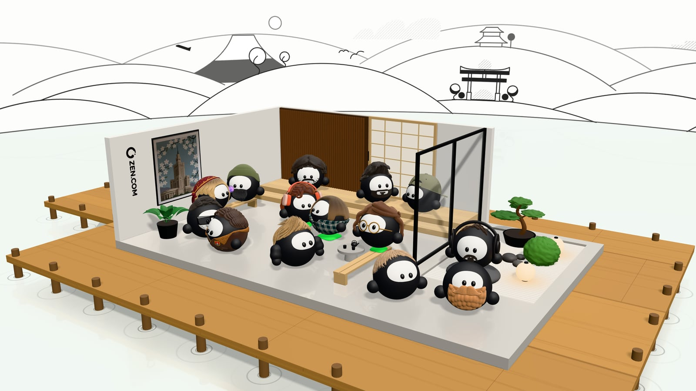

# ZEN Design Team



A thank-you postcard for the ZEN.COM design team: fourteen Zeneks, the ZEN.COM mascot,
one for each designer, chatting in a hand-drawn ZenDS world. Tap anyone to hear what
they have to say.

**Live:** https://artskw.github.io/zen-design-team/

## Highlights

- Fourteen characters, each designed in 2D first and rebuilt in 3D to match.
- A real-time 3D room inside a world drawn in the ZenDS illustration style.
- Characters that hold conversations: turns, gestures, nods, glances.
- A title written by one pen that moves like a hand, then falls away as petals.

## Under the hood

React Three Fiber (three.js), React, TypeScript and Vite. No 3D models: everything is code.

- Hair and beards are signed distance fields, baked offline to meshes; the fabrics are shaders.
- The drawn world is canvas-drawn ink on three rings at different depths, so orbiting gives parallax.
- The title's pen follows handwriting kinematics: one impulse per stroke, slower in curves.

```
src/zenek/   the mascot: body, sculpts, fabric shaders, gestures, conversation
src/set/     the 3D room and the drawn world around it
src/cast/    who sits where, and what they say
src/ui/      loader, handwritten title, petals, speech bubbles
scripts/     offline bakes and visual checks
```

```sh
npm install
npm run dev
```
